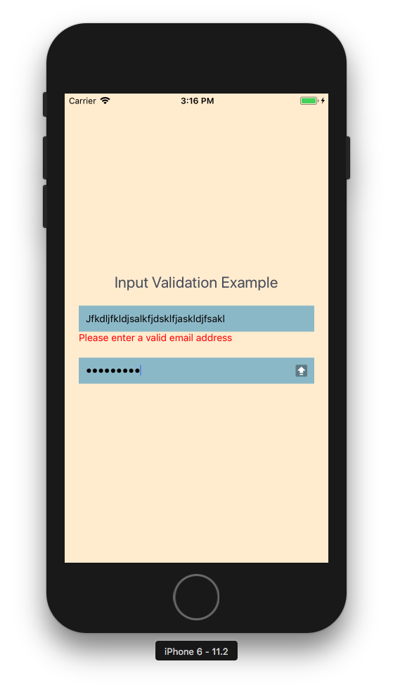

# React Native field validation with validation.js

## Demo app to support upcoming tutorial.

*You will need the RN CLI to run this example*

## Directions

- clone the repo
- `npm install`
- `react-native run-ios` or `react-native run-android`

    

